# Activitat RA2_RA3_RA6 - FASTAPI POSTGRES 

## NOM I COGNOMS: Carlos Alberto Galan Delgado 
### Crear 6 endpoints (create, read, read by id, update by id, update parcial i delete by id) per fer les consultes a la Base de Dades en postgreSQL i mostrar les respostes de l’APIREST amb docs de FastAPI o postman.  

### Endpoints CRUD amb Postgresql:  
### Ceate - Afegir un nou registre a la taula  
* Mètode: POST  
* Funcionalitat: Afegir un nou registre a la taula de la BD.  NO es demana gestionar els errors d’http.  
* Return: Retorna un missatge com a inserció correcta.  

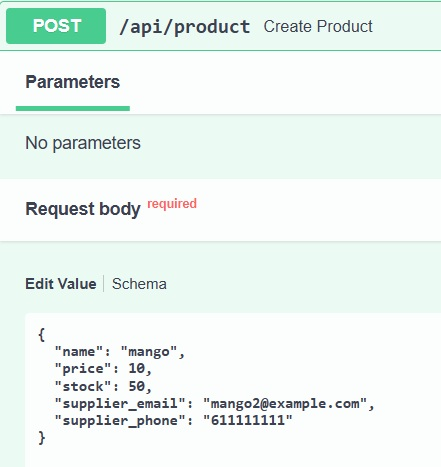
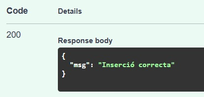

### Read - Consultar totes les dades d’un registre a la taula.  
* Mètode: GET  
* Funcionalitat: Haurà de buscar un registre per id. NO es demana gestionar els errors d’http.  
* Return: Retorna en format sqlmodel adequat.  

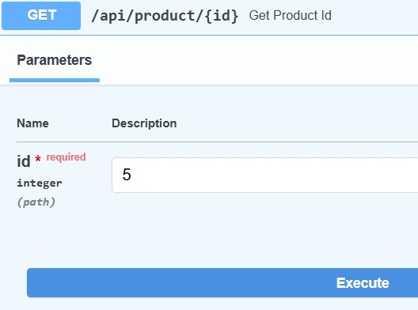
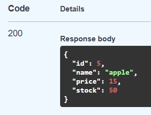

### Read - Consultar totes les dades de tots els registres de la taula.  
Quan el client faci la consulta a /api/product caldrà una resposta per part del servidor amb les dades de tots els registres de la taula. S’han d’evitar enviar dades sensibles al client. indicar amb un comentari en el mateix endpoint les dades sensibles que heu escollit.  

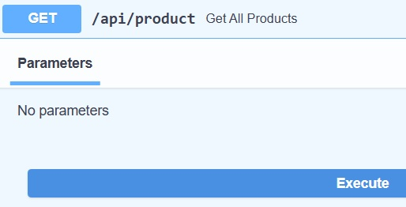
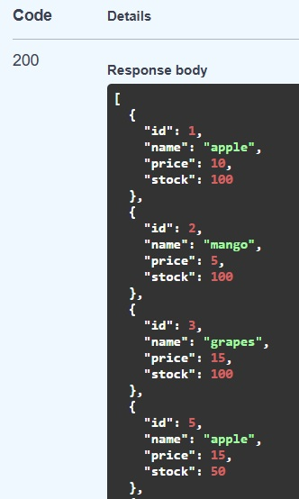 
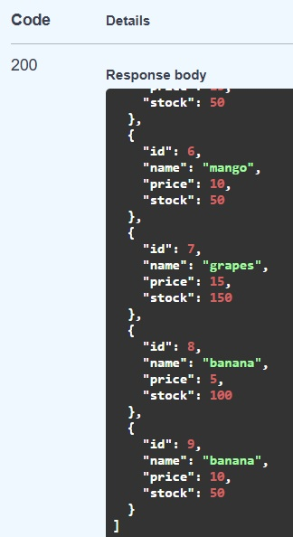

### Read - Consultar les dades filtrant per un camp  
Quan el client faci la consulta a /api/product/{<nom_camp>} (cal substituir <nom-camp> pel nom del camp a filtrar) caldrà una resposta per part del servidor amb les dades d’aquells registres filtrats pel nom del camp.  

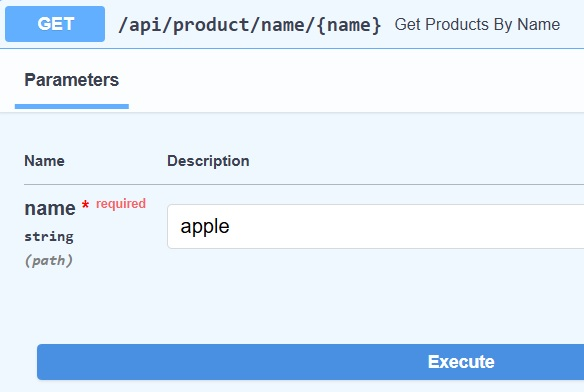
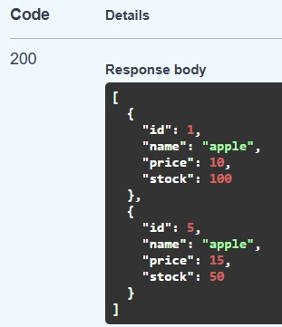

### Delete - Eliminar un registre per id  
Quan el client faci la consulta a /api/product/{id} caldrà tornar una resposta amb un missatge indicant que l’eliminació ha sigut exitosa.  

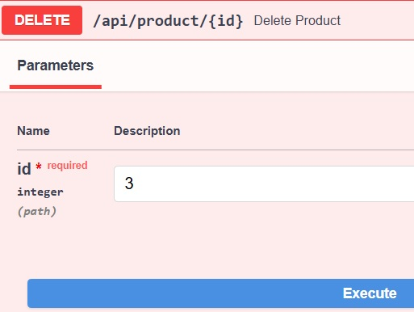
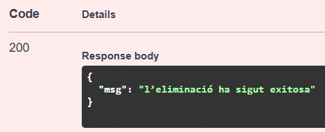
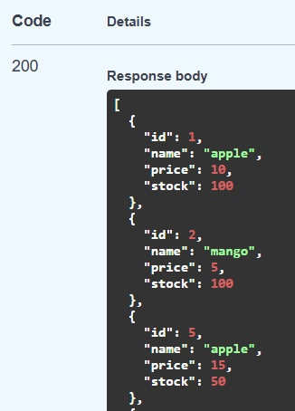

### Read - Lectura parcial  
El client demana poder mostrar unes dades d’un producte. Les dades han de ser 3 camps (escollit per l’alumnat). Cal tenir en compte que 2 camps son sensibles i no es poden retornar en aquest endpoint.  

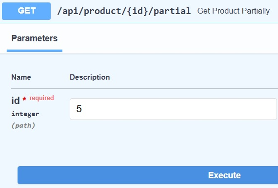
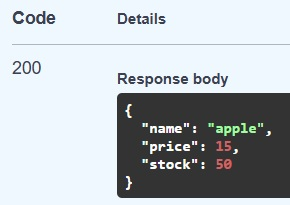  

### Update - Modificació total (PUT)  
El client vol tenir la opció de modificar totes les dades d’un producte. Cal pensar si l’id es pot modificar o no des del client.  

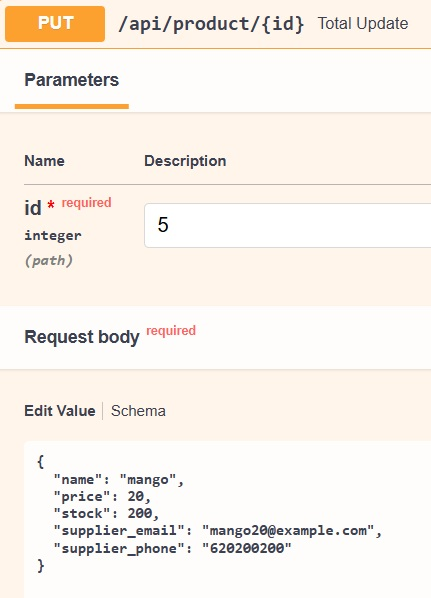
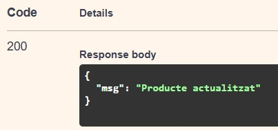  
* Abans  
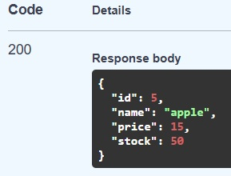  
* Després  
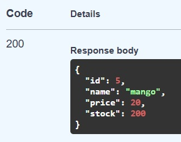  

### Update - Modificació parcial un camp (PATCH)  
El client vol tenir la opció, també, de poder modificar només un camp d’un registre de la taula producte (podeu escollir vosaltres un).  

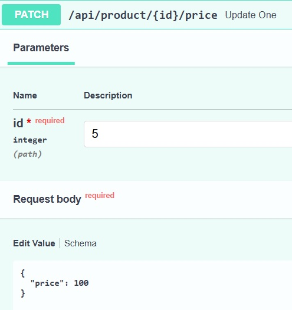  
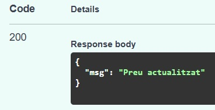  
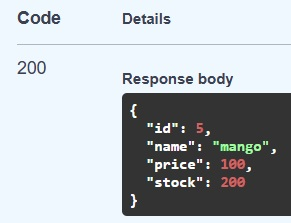  

### Update - Modificació parcial dos camps  
El client vol tenir la opció, també, de poder modificar només dos camps d’un registre de la taula producte (podeu escollir vosaltres).  

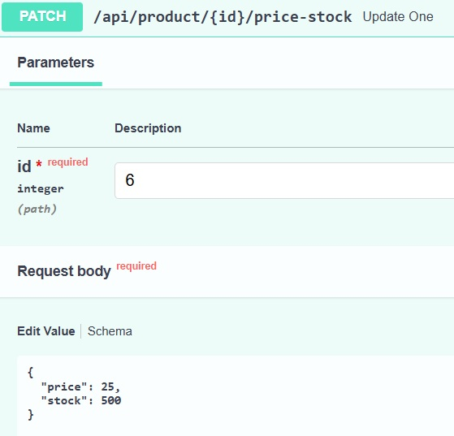
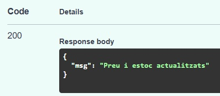  
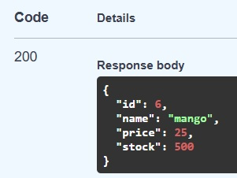
