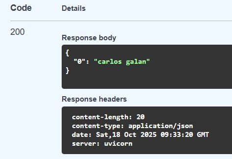
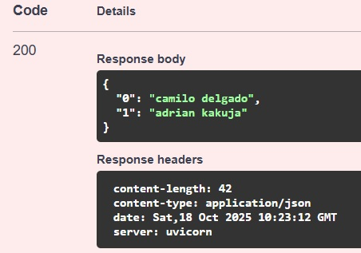
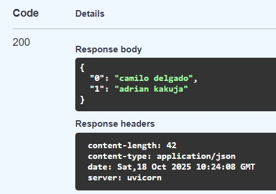

# Activitat RA2_RA3_RA6 - FASTAPI BASICS 

## NOM I COGNOMS: Carlos Alberto Galan Delgado 

### 1. Crear - Afegir a la list
* Endpoint: /api/users  
* Mètode: POST  
* Funcionalitat: Crear un nou objecte nou i afegir-lo a la list de nom users.  
* Return: Retorna, en format diccionari, informació de tota la llista.  

  

### 2. Llegir - Consultar un usuari / objecte de la llista  
* Endpoint: /api/users/{id}
* Mètode: GET
* Funcionalitat: Haurà de buscar l’usuari o objecte de la list amb el que es passi per paràmetre {id}.
* Return: Retorna, en format diccionari, un usuari o un objecte consultat.  

 

### 3. Llegir - Consultar tots els usuaris  
* Endpoint: /api/users
* Mètode: GET
* Funcionalitat: Haurà de buscar tots els usuaris o objectes de la llista.
* Return: Retorna, en format diccionari, totes les dades de la llista.  

  

### 4. Actualitzar - Actualització completa
* Endpoint: /api/users/{id}
* Mètode: PUT
* Funcionalitat: Actualitzar un objecte (sigui una lletra o canvi sencer) de la list.
* Return: Retorna, en format diccionari, totes les dades de la list.  

  

### 5. Eliminar - Esborrar usuari
* Endpoint: /api/usuaris/{id}
* Mètode: DELETE
* Funcionalitat: Eliminar un usuari / objecte de la list.
* Return: Retorna, en format diccionari, tota la llista.  

  
